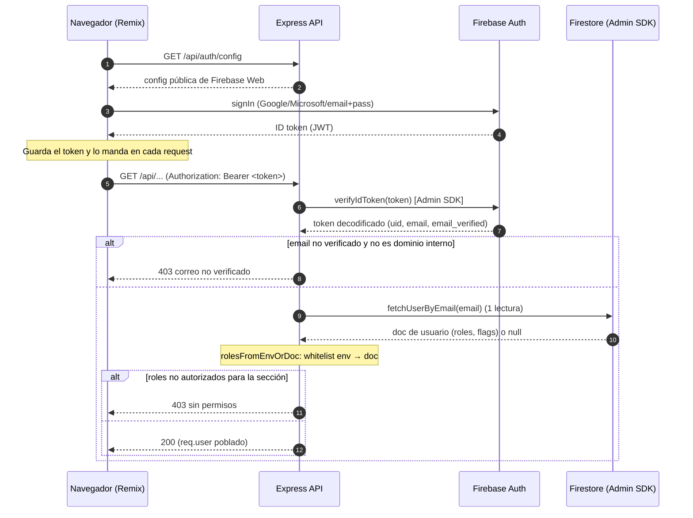
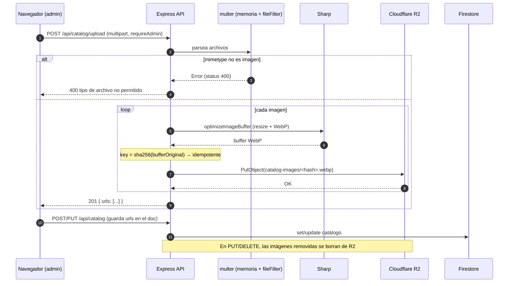
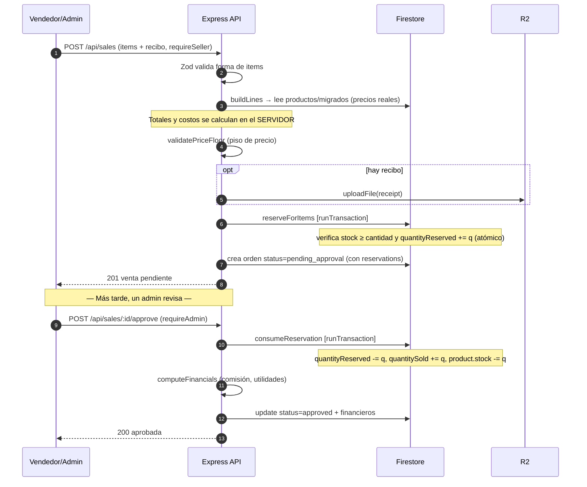

# Diagramas de secuencia — flujos principales

Diagramas Mermaid de los 3 flujos críticos, derivados del código real
(`server/middleware/auth.js`, `server/routes/catalog.js`, `server/routes/sales/*`).

---

## 1. Autenticación y autorización

El navegador **solo usa Firebase Auth**; todo el dato pasa por el backend con el
Admin SDK. Los roles se resuelven en el servidor por request (no hay custom claims).

**Notas de implementación**
- `verifyIdToken` valida firma y expiración (no confía en el cliente).
- **Verificar ≠ autorizar**: `requireRole(...)` (`auth.js`) comprueba que los roles
  resueltos incluyan `global_admin` o alguno permitido antes de dejar pasar.
- La lectura del doc de usuario es **una sola** por request (antes eran dos).

---

## 2. Subida de imagen de producto (R2 + Sharp)

**Notas**
- Nombre por **hash de contenido** → reintentos no duplican objetos en R2.
- `fileFilter` centralizado en `server/utils/upload.js` (imagen; logística acepta PDF).
- Limpieza de huérfanos: `PUT` borra imágenes removidas; `DELETE` borra todas.

---

## 3. Registro y aprobación de una venta

Flujo de dos pasos humanos: el vendedor **registra** (reserva stock) y el admin
**aprueba** (consume stock). El cierre real de la venta ocurre por WhatsApp, fuera del sistema.

**Rechazo / edición / eliminación**
- **Rechazar** (`POST /:id/reject`): `releaseReservation` → `quantityReserved -= q`, status `rejected`.
- **Editar** (`PUT /:id`): libera reservas viejas y reserva nuevas; si la venta ya
  estaba aprobada/pagada, además reajusta stock y registra auditoría.
- **Eliminar** (`DELETE /:id`): si estaba aprobada/pagada, **devuelve** el stock
  (restock) y borra de R2 el recibo y el screenshot de pago.
