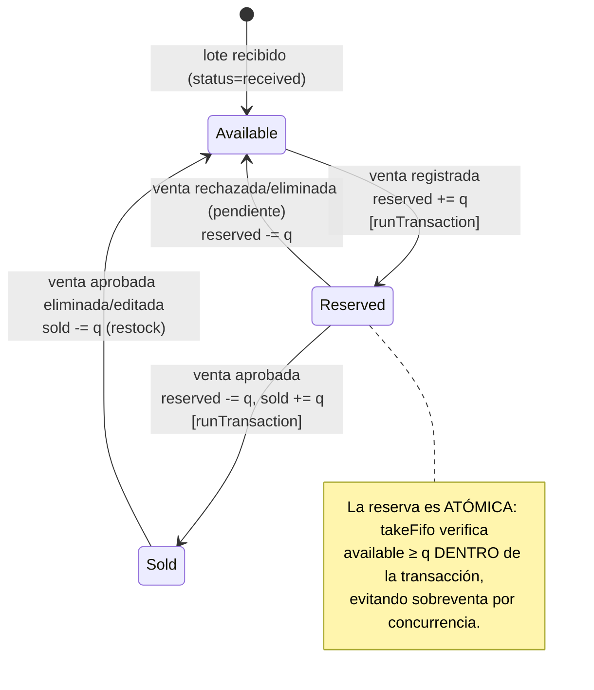
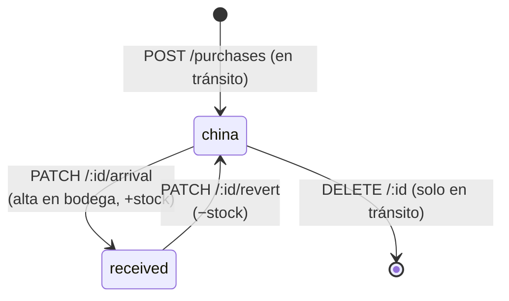

# Máquinas de estado — Venta y Stock

Derivadas de `server/routes/sales/*` y `server/services/sales.js`. Clave para
entender cómo cada transición de la **venta** mueve el **inventario**.

---

## 1. Estado de la VENTA (`orders.status`)

```mermaid
stateDiagram-v2
    [*] --> pending_approval: POST /api/sales<br/>(reserva stock)

    pending_approval --> approved: POST /:id/approve<br/>(consume reserva → vendido)
    pending_approval --> rejected: POST /:id/reject<br/>(libera reserva)
    pending_approval --> [*]: DELETE /:id<br/>(libera reserva)

    approved --> paid: POST /:id/pay | pay-week<br/>(sale el pago al vendedor)
    approved --> [*]: DELETE /:id<br/>(DEVUELVE stock)

    paid --> [*]: DELETE /:id<br/>(DEVUELVE stock + ajuste de saldo)

    rejected --> [*]: DELETE /:id<br/>(reserva ya liberada; no toca stock)

    note right of approved
        Editar (PUT /:id) re-reserva stock
        y reajusta comisión/utilidades;
        registra audit_logs.
    end note
```

**Reglas invariantes**
- Solo se **aprueba** una venta `pending_approval`.
- No se puede **rechazar** una venta `approved`.
- **Rechazo** y **eliminación** exigen motivo (auditoría).
- La comisión/utilidad se **fija al aprobar** y se recalcula en cada edición.

---

## 2. Estado del STOCK (por unidad de un lote)

Cada lote de `purchases`/`migrated_inventory` lleva tres contadores:
`quantity` (compradas), `quantityReserved`, `quantitySold`.
`available = quantity − quantitySold − quantityReserved`.

**Puntos clave de consistencia (ya implementados correctamente)**
- `reserveForItems`, `consumeReservation`, `reserveForMigratedItems` y el consumo
  FIFO corren en `db.runTransaction` → verificación + escritura atómicas.
- Las operaciones de **solo incremento** (liberar reserva, restock) usan
  `FieldValue.increment` sin transacción (no necesitan verificar nada) y ahora
  **registran** en el logger si fallan (antes se tragaban en silencio).

**Ciclo de vida del LOTE (`purchases.status`)**

