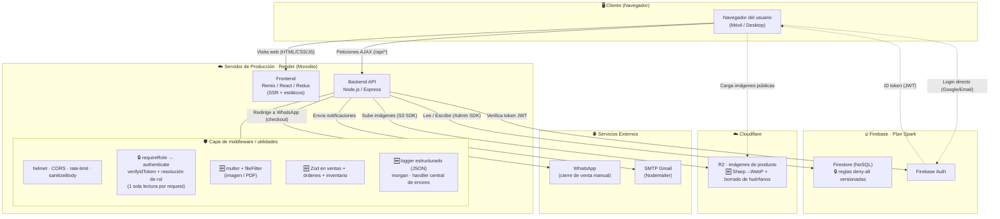

# Diagrama de arquitectura (actualizado)

Vista de runtime del sistema tras el saneamiento de deuda técnica. Los elementos
marcados 🆕 / 🔒 son nuevos o endurecidos respecto a la versión anterior.

## Leyenda de cambios
- 🔒 **Endurecido**: superficie de seguridad reforzada sobre algo que ya existía.
- 🆕 **Nuevo**: pieza que antes no estaba.

## Principio de seguridad clave (sin cambios, ahora blindado)
El navegador **solo** usa Firebase **Auth**. **Nunca** lee ni escribe Firestore
directamente: todo el dato pasa por el backend con el Admin SDK. Las reglas
**deny-all** cierran por completo el acceso directo del cliente a la base (ADR-008).
